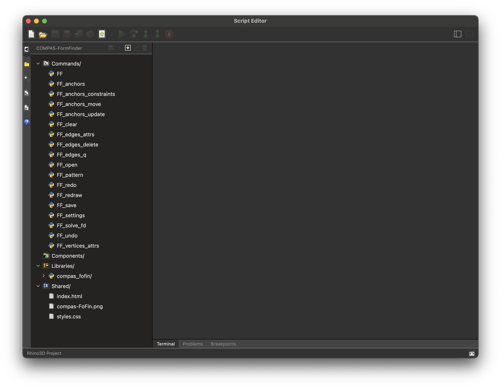
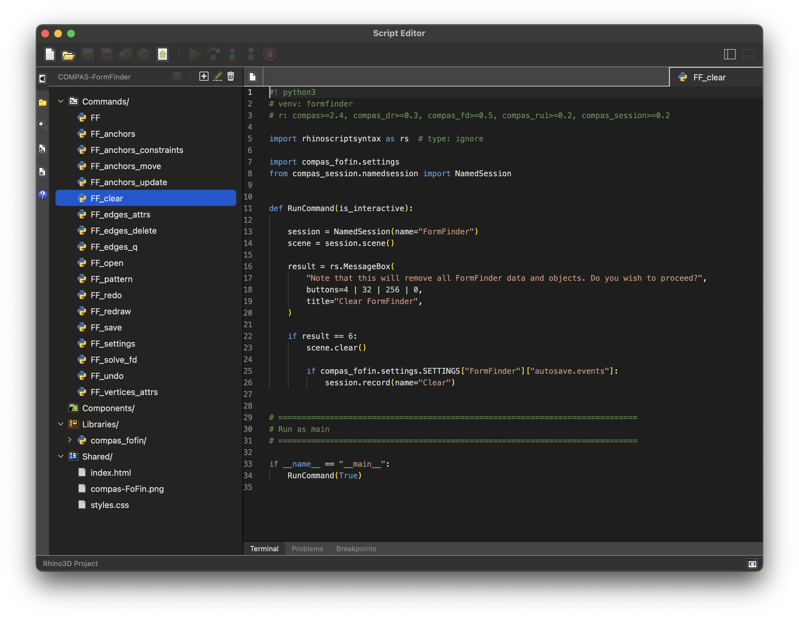
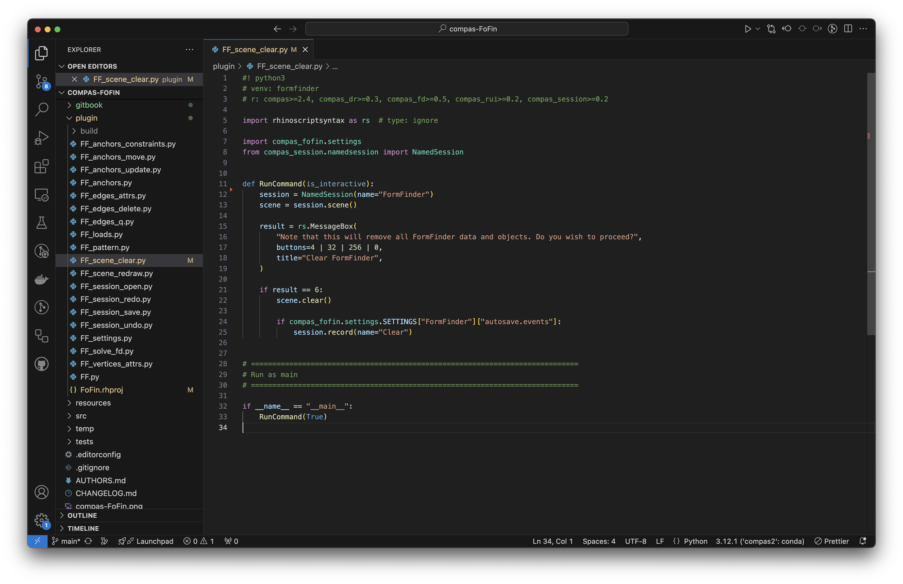

# Developer Guide

This guide contains instructions to help you get started with contributing to the public implementation of COMPAS FormFinder
or to create custom functionality for your own personal setup.

## Requirements

* Rhino 8
* VS Code (or similar, optional)

## Preparation

As a first step, clone the development repo onto your computer.

```bash
git clone https://github.com/BlockResearchGroup/compas-FoFin.git
```

## Rhino Setup

The Rhino commands of COMPAS FormFinder define their own requirements
at the top of each command script using the Rhino requirements comment syntax.
If any of these requirements is not already available in Rhino,
they will be installed automatically in an environment called `formfinder`.

```python
#! python3
# venv: formfinder
# r: compas>=2.4, compas_dr>=0.3, compas_fd>=0.5, compas_rui>=0.2, compas_session>=0.2
```

If you want to modify a command in a way that requires additional packages,
or different versions of packages, you should make the corresponding changes in those comments.

## Plugin Project

The plugin project is defined in `plugin/FoFin.rhproj`.
This is essentially a JSON file will all project settings, which can be modified in Rhino Script Editor.

To open the editor, type `ScriptEditor`.
Then open the project with `File > Open Project`.



You can add new commands, embed libraries, or add shared resources.
Whenever you make a changes, the project has to be rebuilt,
and you have to restart Rhino before the changes have any effect.


## Modify Commands

The items listed under `Commands` in the project browser are command names
and provide only "views" of the corresponding source code.
This view cannot be modifed.



To modify a command, you need to open the actual corresponding script.
Note that the command name is not necessarily the same as the script name.

My personal preference is to work on the scripts in VS Code,
and to use the Rhino Script Editor to update the plugin project.



## Build RUI
