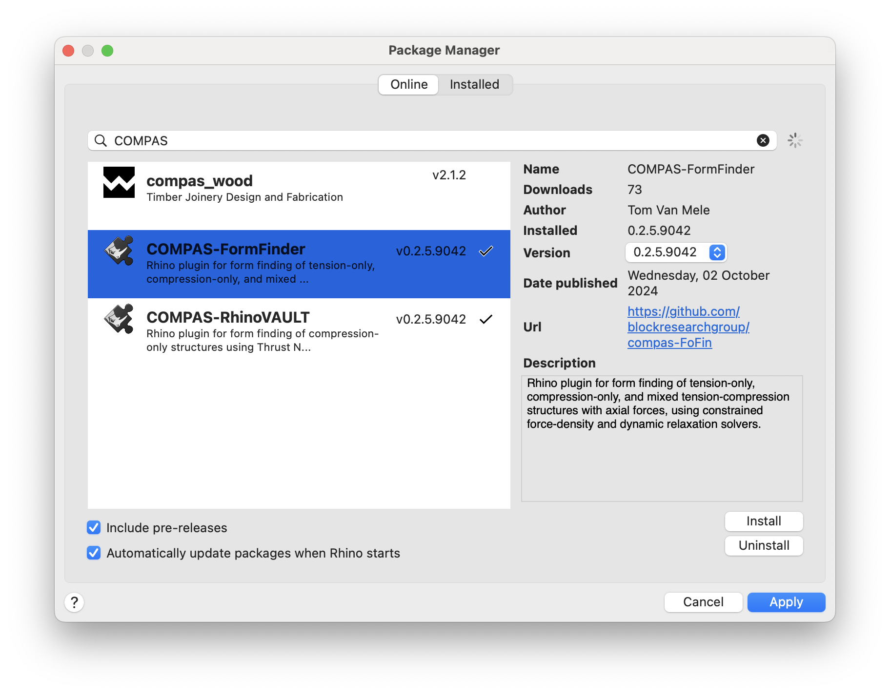
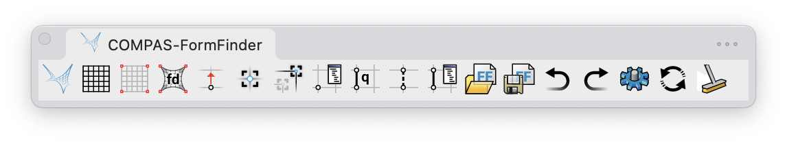

# COMPAS Formfinder for Rhino

COMPAS Formfinder for Rhino is a plugin for Rhino 8
that can be used for form-finding tension-only, compression-only,
and mixed tension-compression structures,
using constrained force-density and constrained dynamric relaxation solvers.

> [!WARNING]  
> This plugin is under active development,
> and uses the still somewhat unstable CPython infrastructure
> of Rhino 8 through the new ScriptEditor.
> Therefore, unexpected errors may occur here and there.
> Please let us know via the [Issue Tracker](https://github.com/BlockResearchGroup/compas-FoFin/issues) if you have problems.

## Installation

To install FormFinder, use Rhino's package manager Yak.

## COMPAS Packages

FormFinder uses the following COMPAS packages:

* [compas](https://github.com/compas-dev/compas)
* [compas_dr](https://github.com/blockresearchgroup/compas_dr)
* [compas_fd](https://github.com/blockresearchgroup/compas_fd)
* [compas_rui](https://github.com/blockresearchgroup/compas_rui)
* [compas_session](https://github.com/blockresearchgroup/compas_session)

After installing FormFinder with Yak, you can check if all requirements are installed using the command `RV_reqs_check`.

### Basic Users

Missing requirements can be installed automatically using the command `RV_reqs_install`.
This command uses Rhino's built in installation mechanism for Python packages (`# r: ...`).

### Advanced Users

If you use Rhino for scripting, and if you have other COMPAS packages installed, or plan to install them in the future, we recommend to install FormFinder's requirements manually using `pip`.

> [!WARNING]
> `pip` based installations and `# r: ...` based installations should not be mixed,
> since this will create conflicts between packages and package versions.

## User Interface

COMPAS FormFinder defines the following Rhino commands:

* `FF`
* `FF_pattern`
* `FF_anchors`
* `FF_anchors_constraints`
* `FF_anchors_update`
* `FF_anchors_move`
* `FF_solve_fd`
* `FF_edges_q`
* `FF_edges_delete`
* `FF_vertices_attrs`
* `FF_edges_attrs`
* `FF_session_undo`
* `FF_session_redo`
* `FF_session_open`
* `FF_session_save`
* `FF_scene_clear`
* `FF_scene_redraw`
* `FF_settings`
* `FF_reqs_check`
* `FF_reqs_install`

These commands can be executed at the Rhino Command Prompt (simply start typing the command name),
or using the FormFinder toolbar.

## Documentation

For further "getting started" instructions, a tutorial, examples, and an detailed description of the individual commands and the user interface, please check out the online documentation here: [FormFinder Gitbook](https://blockresearchgroup.gitbook.io/FormFinder)

## Issues

Please report problems using the issue tracker of the github repo: <https://github.com/blockresearchgroup/compas-FoFin/issues>
