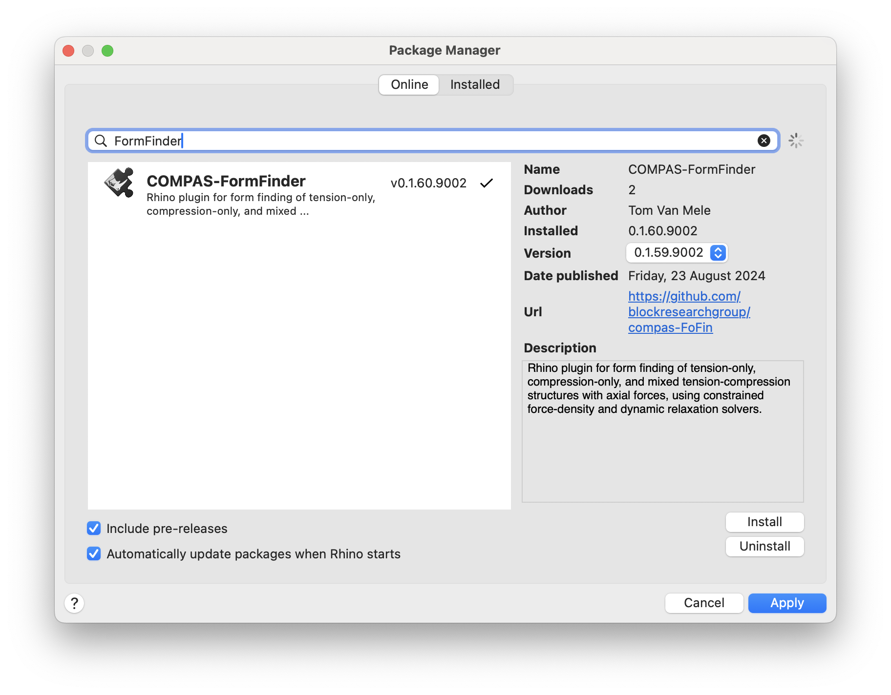
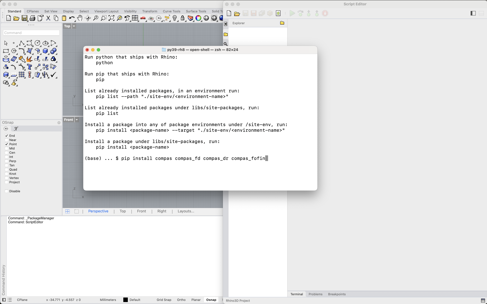

# COMPAS Formfinder for Rhino

COMPAS Formfinder for Rhino is a plugin for Rhino 8
that can be used for form-finding tension-only, compression-only,
and mixed tension-compression structures,
using constrained force-density and constrained dynamric relaxation solvers.

> [!WARNING]  
> This plugin is under active development,
> and uses the still somewhat unstable CPython infrastructure
> of Rhino 8 through the new ScriptEditor.
> Therefore, unexpected errors may occur here and there.
> Please let us know via the [Issue Tracker](https://github.com/BlockResearchGroup/compas-FoFin/issues) if you have problems.

## Installation

The plugin can be installed using Rhino's package manager Yak.

## COMPAS Packages

The plugin is based on COMPAS and written entirely in Python.
It uses the following packages of the COMPAS framework:

* [compas](https://github.com/compas-dev/compas)
* [compas_fd](https://github.com/blockresearchgroup/compas_fd)
* [compas_dr](https://github.com/blockresearchgroup/compas_dr)

Note that, at least for now, these packages have to be installed separately from the plugin itself.
This can be done as described in the COMPAS docs (see [Working in Rhino 8](https://compas.dev/compas/latest/userguide/cad.rhino8.html)),
or using the Python3 shell available in the Rhino ScriptEditor.

> [!WARNING]  
> We recommend using `pip` based install exclusively,
> and not mix this installation mechanism with the `# r: package`
> syntax available for CPython scripts in the new Rhino ScriptEditor,
> since this can result in duplicated package installations with incompatible versions.

## Documentation

The functionality of the plugin is documented in this gitbook: <https://blockresearchgroup.gitbook.io/compas-fofin>.

## Issues

Please report problems using the issue tracker of the github repo: <https://github.com/BlockResearchGroup/compas-FoFin/issues>
