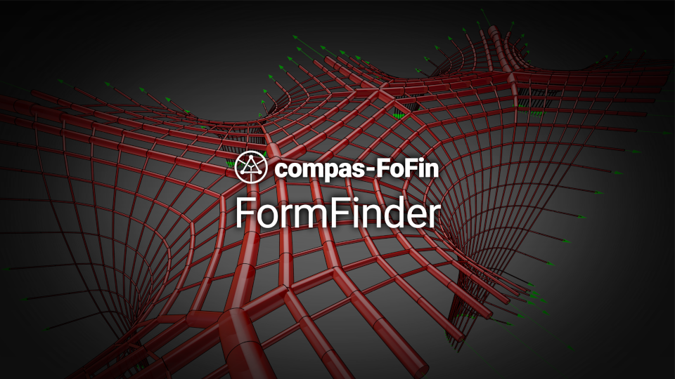

# About

<figure><figcaption>
COMPAS FormFinder is a plugin for Rhino 8 for form finding of tensile surface structures and strut-and-tie models.
</figcaption></figure>

COMPAS FormFinder is a plugin for Rhino 8 for form finding and structural design of two-dimensional and three-dimensional structural systems with axial force members in tension and compression.

The plugin is written entirely in Python using the COMPAS framework, and can be installed in Rhino 8 using Yak, the official package manager of Rhino.

_More information coming soon..._
