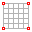

# Curve Constraints - Geometry Generation

This example shows how to ...

* create a geometry based on curve constraints as boundary
* so that the cable net finds equilibrium with reaction forces acting normal only to the boundary curves.&#x20;

This geometry was designed and materialized in a [research project](https://block.arch.ethz.ch/brg/project/cable-net-fabric-formed-thin-shell-buda-tx-usa) by the BRG together with Escobedo Construction in 2014 in Texas.

<figure><figcaption>
.Cable-net and fabric formed thin shell, Buda, TX, USA, 2014
</figcaption></figure>

## 0. Input

Start with the target boundary curves by opening the Rhino File:



<figure><figcaption></figcaption></figure>

## 1.  Create CableMesh

> **from RhinoSurface**
>
> **Number of faces in the U direction: 9**
>
> **Number of faces in the V direction: 19**

Create a CableMesh data structure from a planar Rhino surface that spans between the endpoints of the curves.&#x20;

<figure><figcaption></figcaption></figure>

<figure><figcaption></figcaption></figure>

## 2. Identify Anchors

<figure><figcaption></figcaption></figure>

> **Select**&#x20;
>
> **Boundary**

Anchor its corner vertices along the boundary.

<figure><figcaption></figcaption></figure>

## 3.  Set Anchor Constraints

<figure><figcaption></figcaption></figure>

> **Select**
>
> **By Continuous Edges**

Select the anchors along continuous edges along the boundary and constrain them to the respective target boundary curve. Pay attention to not select the vertices in the corner, but only the ones in between corners.

<figure><figcaption></figcaption></figure>

## 4.  Force Density Method

<figure><figcaption></figcaption></figure>

The CableMesh can now be form found with the Force Density method.&#x20;

<figure><figcaption></figcaption></figure>
