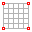

# Arch supported

<figure><figcaption></figcaption></figure>

This example shows how to...

* start from a cylinder
* assign anchors along the boundaries
* scale force densities in the UV directions
* delete edges
* to create the shape of an arch-supported membrane.

An arc-supported membrane is one of the main primitive typologies for membranes from which many other membrane geometries are composed.&#x20;

<figure><figcaption>
arc-supported membranes, Poruklu Marina
</figcaption></figure>

The following steps show how to create a arch-supported membrane with compas-FoFin:

## 0. Create Rhino Cylinder

Create a Rhino Cylinder Object with the **Cylinder** command:

<figure><figcaption></figcaption></figure>

## 1.  Create CableMesh

<figure><figcaption></figcaption></figure>

> **from RhinoCylinder**
>
> **Number of faces along perimeter: 16 (default)**
>
> **Number of faces along height: 4 (default)**

Transform the Rhino Cylinder into a CableMesh with the from RhinoCylinder option.

<figure><figcaption></figcaption></figure>

## 2.  Identity Anchors

<figure><figcaption></figcaption></figure>

> **Select**&#x20;
>
> **Boundary**

Anchor its nodes on the two boundaries so that they can take reaction forces.

<figure><figcaption></figcaption></figure>

## 3.  Force Density Method

<figure><figcaption></figcaption></figure>

Find the equilibrium form with the Force Density Method (FD).&#x20;

<figure><figcaption></figcaption></figure>

## 4.  Scale Force Densities

<figure><figcaption></figcaption></figure>

> **Interactive**
>
> **UV**

Select all continuous edges in one direction, either U or V and scale them interactively.&#x20;

<figure><figcaption></figcaption></figure>

The higher the qs in the longitudinal direction relative to the hoop direction the straighter the cylinder:

<figure><figcaption></figcaption></figure>

The lower the qs in the longitudinal direction relative to the hoop direction the more narrow-waisted becomes the cylinder:

<figure><figcaption></figcaption></figure>

This is a closed-arch supported membrane. To form find an arch-supported membrane, the topoly of the CableMesh must be modified.

## 5.  **Delete** Edges&#x20;

<figure><figcaption></figcaption></figure>

> **Manual**

Delete all edges of one side of the cylinder.

<figure><figcaption></figcaption></figure>

<figure><figcaption></figcaption></figure>

The current release does not allow you to rotate the session file yet, so just rotate your viewport by 90 degrees:

<figure><figcaption></figcaption></figure>

## 6.  Scale Force Densities

<figure><figcaption></figcaption></figure>

> **Interactive**
>
> **Continuous**

Scale the free boundary edges to pull them down with "edge cables":

<figure><figcaption></figcaption></figure>

This results in the anticipated arch-supported membrane design:

<figure><figcaption></figcaption></figure>
