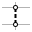

# Conical

<figure><figcaption></figcaption></figure>

This example shows how to...

* select anchors by boundaries and manual selection and unselect anchors
* modify the topology of the CableMesh
* move anchors
* tweak force densities&#x20;
* to control a shape of a membrane into a conical geometry with a light-eye.

The conical membrane is one of the main primitive typologies for membranes from which many other membrane geometries are composed. It can come with a single anchor point (however this results in high stress concentrations), a circular fixed boundary, or a single anchor with an eye-shaped opening.

The German Pavillion of the World Expo in 1967 in Montreal by Frei Otto and Rolf Gutbrod is a good example for the eye-shaped design.

<figure><figcaption></figcaption></figure>

Back then, physical form finding with soap films and stockings defined the shape in the absence of digital form-finding tools:

<figure><figcaption></figcaption></figure>

<figure><figcaption></figcaption></figure>

The following steps show how to create such a conical membrane with COMPAS-FormFinder:

## 1.  Create MeshGrid

<figure><figcaption></figcaption></figure>

> **from Meshgrid**
>
> **Number of faces in the X direction: 10 (default)**
>
> **Number of faces in the Y direction: 10 (default)**
>
> **Dimension in the X direction: 10 (default)**
>
> **Dimension in the Y direction: 10 (default)**

Create a MeshGrid data structure with the fastest way of a regular default grid in the XY plane.

<figure><figcaption></figcaption></figure>

## 2.  Identity Anchors

<figure><figcaption></figcaption></figure>

> **Select**&#x20;
>
> **Boundaries, Manual**

Anchor its boundary nodes and a node in the centre of the mesh.

<figure><figcaption>
boundaries
</figcaption></figure>

<figure><figcaption>
manual
</figcaption></figure>

## 3.  Move Nodes

<figure><figcaption></figcaption></figure>

> **Manual**
>
> **Z**

Move the centre node upwards in the Z direction.

<figure><figcaption></figcaption></figure>

## 4.  Force Density Method

<figure><figcaption></figcaption></figure>

Find the equilibrium form with the Force Density Method (FD).

<figure><figcaption></figcaption></figure>

## 5.  **Remove** Edges&#x20;

<figure><figcaption></figcaption></figure>

> **Manual**

Delete edges in the centre in the adjacency of the anchor.&#x20;


Deleting edges of the CableMesh will also delete the adjacent faces (that by default are not shown) and the resulting unused nodes.


<figure><figcaption></figcaption></figure>

<figure><figcaption></figcaption></figure>

## 6.  Force Density Method

<figure><figcaption></figcaption></figure>

Again find the equilibrium form with FD with the new topology resulting in the smooth light-eye opening in the centre.

<figure><figcaption></figcaption></figure>

## 7.  Scale Force Densities

<figure><figcaption></figcaption></figure>

> **Interactive**
>
> &#x20;**Boundaries**

Select all boundary edges and scale their force densities by a factor of e.g. 5. The anchored boundary will not be affected by this modification.&#x20;

<figure><figcaption></figcaption></figure>

## 8.  Force Density Method

<figure><figcaption></figcaption></figure>

Again find the equilibrium form with FD with force densities along the boundaries that would be materialized as edge cables.&#x20;

With the value of q set to 5 on the boundaries the light-eye becomes small:

<figure><figcaption></figcaption></figure>

For comparison, the light-eye becomes large for the q's on the boundaries set to 0.5:

<figure><figcaption></figcaption></figure>

## 9.  Identity Anchors

<figure><figcaption></figcaption></figure>

> **Unselect**
>
> **Manual**

Manually unselect anchors along the outer boundary so that the design approximates the Expo Pavilion.

<figure><figcaption></figcaption></figure>

<figure><figcaption></figcaption></figure>

## 10.  Force Density Method

<figure><figcaption></figcaption></figure>

The equilibrium shape results in the following design:

<figure><figcaption></figcaption></figure>
