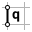

# Hypar

<figure><figcaption></figcaption></figure>

This example shows how to...

* assign anchors in corners
* move anchors
* scale force densities along the boundary to introduce boundary cables
* to control the shape of a membrane into a hypar geometry.

A hypar is one of the main primitive typologies for membranes from which many other membrane geometries are composed. It is also known as four-point sail or saddle surface.

The first mechanically prestressed membrane was at the Bundesgartenschau in Kassel in 1955 by the pioneer Frei Otto:

<figure><figcaption>
Bundesgartenschau Kassel, 1955 (source: Atelier Frei Otto)
</figcaption></figure>

Back then, physical form finding with soap films defined the shape in the absence of digital form-finding tools:

<figure><figcaption></figcaption></figure>

The following steps show how to create a hypar with compas-FoFin:

## 1.  Create MeshGrid

<figure><figcaption></figcaption></figure>

> **from Meshgrid**
>
> **Number of faces in the X direction: 10 (default)**
>
> **Number of faces in the Y direction: 10 (default)**
>
> **Dimension in the X direction: 10 (default)**
>
> **Dimension in the Y direction: 10 (default)**

Create a MeshGrid data structure with the fastest way of a regular default grid in the XY plane.

<figure><figcaption></figcaption></figure>

## 2.  Identity Anchors

<figure><figcaption></figcaption></figure>

> **Select**&#x20;
>
> **Corners**

Anchor its corner vertices so that they can take reaction forces.

<figure><figcaption></figcaption></figure>

## 3.  Move Nodes

<figure><figcaption></figcaption></figure>

> **Manual**&#x20;
>
> **Z**

Manually select two opposite corner vertices and move them upwards in the Z direction.&#x20;


When moving nodes, you can select between free and constrained directions that allow you to move in a more controlled manner.


<figure><figcaption></figcaption></figure>

## 4.  Force Density Method

<figure><figcaption></figcaption></figure>

Find the equilibrium form with the Force Density Method (FD).&#x20;

<figure><figcaption></figcaption></figure>


The equilibrium can be found after any step as long as meaningful anchors are set.&#x20;


The shape does correspond neither to the shape of the soap film experiment nor the pavilion structure. This is because there is higher tension in the boundary materialized with an edge cable or edge wire, respectively. So we must increase the force densities in the edges along the free boundaries.

## 5.  Scale Force Densities

<figure><figcaption></figcaption></figure>

> **Scaling mode: Interactive**
>
> **Selection mode: Boundaries**

Select the edges along the boundary and scale up their force densities (q) interactively by a factor of, e.g., 5.&#x20;


You must first set a **Base Point for Scaling**, then a **Reference point 1** and a **Reference Point 2.** Depending on the distance of the base to the first reference point is the sensitivity for scaling to the second reference point. The scaling factor is displayed in Rhino.


<figure><figcaption></figcaption></figure>

## 6.  Force Density Method

<figure><figcaption></figcaption></figure>

Again find the equilibrium form with FD with the new state of force densities resulting in the target geometry of the hypar.

<figure><figcaption></figcaption></figure>
