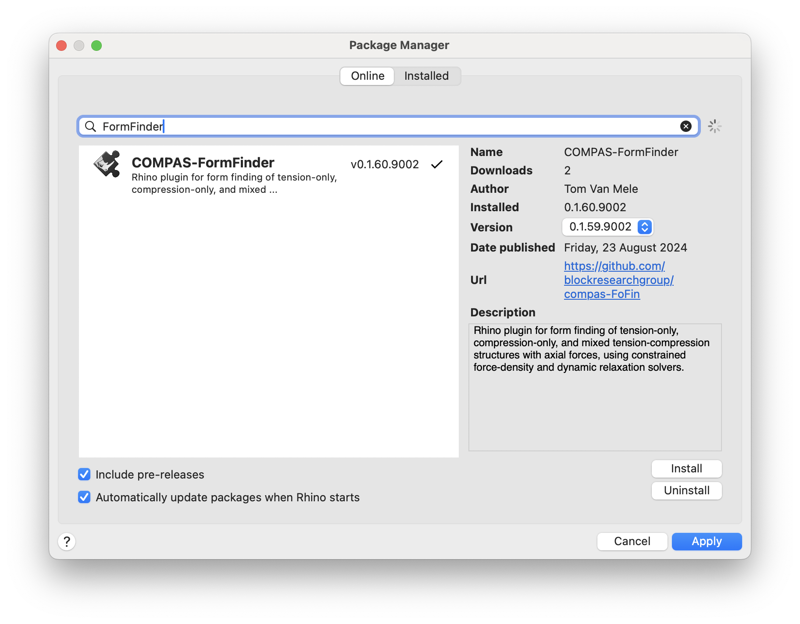

# Getting Started

COMPAS FormFinder is a plugin for Rhino 8. It uses the CPython runtime that is newly available in Rhino 8, and can only be installed using the package manager Yak.


COMPAS FormFinder is only available for Rhino 8.


## Requirements

* [Rhino 8](https://www.rhino3d.com/)

## Installation

Start Rhino 8 and launch Yak from the "Tools" menu: ``Tools > Package Manager``.
Search the online packages for "FormFinder".
Select "COMPAS FormFinder" from the list, and install.

<figure><figcaption>
COMPAS FormFinder can be installed using Yak, the package manager of Rhino.
</figcaption></figure>

## COMPAS Packages

## Toolbar

## Check the Installation
