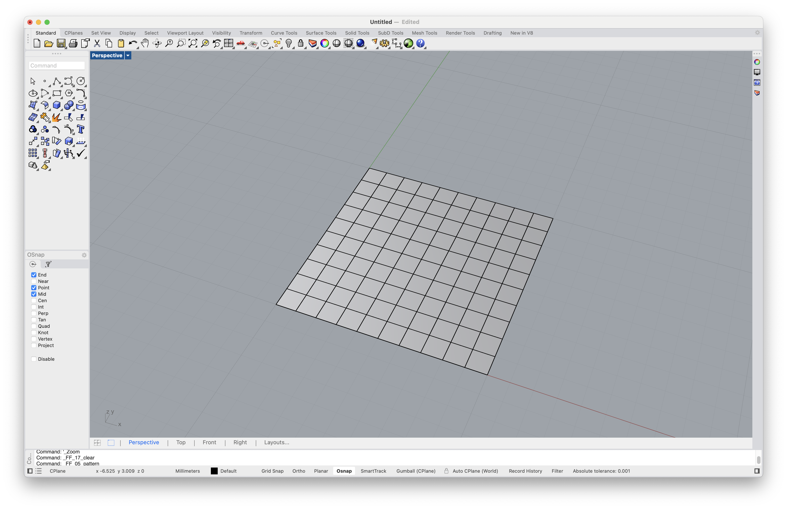

# Tutorial

In this tutorial we design a simple tensile surface in the shape of a hypar, following this 5-step procedure.

1. Create a mesh surface with quadrilateral faces (i.e. a quad mesh).
2. Fix the corner vertices of the mesh (vertices with `degree = 2`).
3. Move two of the corner vertices to an elevated position.
4. Scale the force densities of one of the boundaries.
5. Constrain one of the vertices to a line.

After steps 2, 3, 4, and 5, we compute the resulting equilibrium shape.

## Create a QuadMesh

To create a simple quad mesh, we use the [FF_pattern](../manual/user-interface.md#ff_pattern) button of the toolbar, and select the option "MeshGrid".

We accept the default `X Size`, the default `Y Size`, the default number of `X faces`, and the default number of `Y faces`.

<figure><figcaption>
Create a quad mesh from a "MeshGrid".
</figcaption></figure>

## Fix the Corners

To add anchors (or supports) to the surface, we use the [FF_anchors](../manual/user-interface.md#ff_anchors) button, and select the option "Add".

In a quad mesh, the corners have `degree = 2`. Therefore, to select the corner vertices, we use "Select By Degree" and type `2`.


See [Selecting Vertices](../manual/selecting-vertices.md) for more information about the different selection options.


Once we have properly anchored our surface, we can compute an initial equilibrium shape using the [FF_solve_fd](../manual/user-interface.md#ff_solve_fd) button.

## Move Two Corners

## Scale Force Densities

## Add a Constraint
