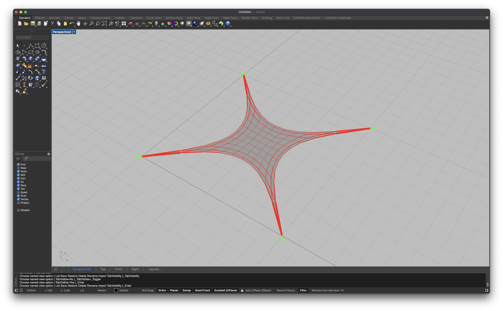
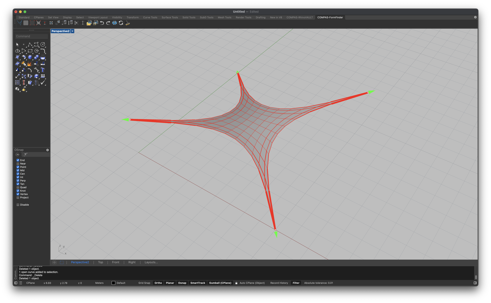
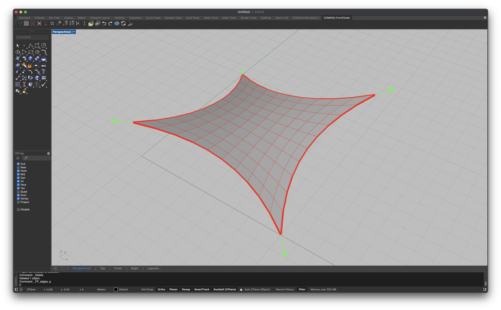

# Tutorial

In this tutorial we design a simple tensile surface in the shape of a hypar, following this 5-step procedure.

1. Create a mesh surface with quadrilateral faces (i.e. a quad mesh).
2. Fix the corner vertices of the mesh (vertices with `degree = 2`).
3. Move two of the corner vertices to an elevated position.
4. Scale the force densities of one of the boundaries.
5. Constrain one of the vertices to a line.

After steps 2, 3, 4, and 5, we compute the resulting equilibrium shape.

## Create a QuadMesh

We start by creating a quad mesh surface from a "MeshGrid" (cf. [Mesh.from\_meshgrid](https://compas.dev/compas/latest/api/generated/compas.datastructures.Mesh.from_meshgrid.html)).&#x20;

* Click button [FF\_pattern](../manual/user-interface.md#ff_pattern)
* Select option "MeshGrid"
* Accept default `X Size` (10)
* Accept default `Y Size` (same as X)
* Accept default `X Faces` (10)
* Accept default `Y Faces` (same as X)

<figure><figcaption>
Create a quad mesh from a "MeshGrid".
</figcaption></figure>

## Fix the Corners

To add anchors (or supports) to the surface, we use the [FF\_anchors](../manual/user-interface.md#ff_anchors) button, and select the option "Add".

In a quad mesh, the corners have `degree = 2`. Therefore, to select the corner vertices, we use "Select By Degree" and type `2`.


See [Selecting Vertices](../manual/selecting-vertices.md) for more information about the different selection options.


<figure><figcaption>
Fix the corners of the mesh surface.
</figcaption></figure>

Once we have properly anchored our surface, we can compute an initial equilibrium shape using the [FF\_solve\_fd](../manual/user-interface.md#ff_solve_fd) button.

<figure><figcaption>
Compute an initial equilibrium shape.
</figcaption></figure>

By default, the forces in the edges are displayed as pipes in a colour code from red for tensile forces over white for low forces to blue for compressive forces and diameter according to their magnitude. The reaction forces are shown as green arrows with their size depending on their force magnitude.&#x20;

## Move Two Corners

Currently, our entire structure lies in the XY plane. To create a hypar, we lift two of the supports out of the plane, such that we have two high and two low anchor points. We use [FF\_anchors\_move](../manual/user-interface.md#ff_anchors_move) to lift the anchors. After clicking on [FF\_Anchors\_move](../manual/user-interface.md#ff_anchors_move), click on Z, since we want to move two supports along the Z direction, and then click on Manual to manually select the two supports you would like to move. Select both supports and move them up at a certain distance from the XY plane. The equilibrium of the mesh will be automatically updated.&#x20;

<figure><figcaption></figcaption></figure>

## Scale Force Densities

<figure><figcaption></figcaption></figure>

<figure><figcaption></figcaption></figure>

## Add a Constraint
