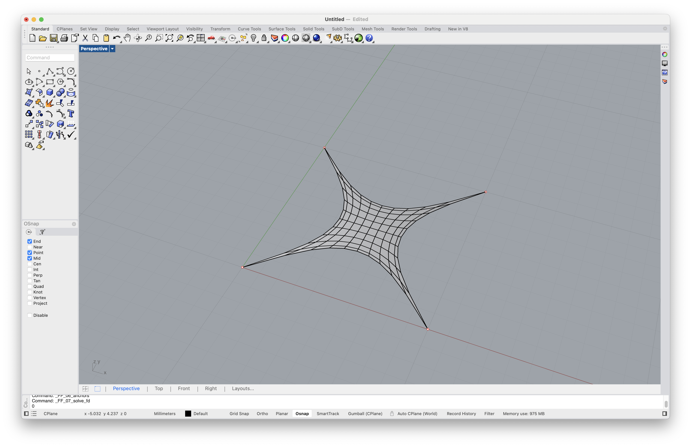

# Tutorial

In this tutorial we design a simple tensile surface in the shape of a hypar, following this 5-step procedure.

1. Create a mesh surface with quadrilateral faces (i.e. a quad mesh).
2. Fix the corner vertices of the mesh (vertices with `degree = 2`).
3. Move two of the corner vertices to an elevated position.
4. Scale the force densities of one of the boundaries.
5. Constrain one of the vertices to a line.

After steps 2, 3, 4, and 5, we compute the resulting equilibrium shape.

## Create a QuadMesh

We start by creating a quad mesh surface from a "MeshGrid" (cf. [Mesh.from_meshgrid](https://compas.dev/compas/latest/api/generated/compas.datastructures.Mesh.from_meshgrid.html)).

* Click button [FF_pattern](../manual/user-interface.md#ff_pattern)
* Select option "MeshGrid"
* Accept default `X Size` (10)
* Accept default `Y Size` (same as X)
* Accept default `X Faces` (10)
* Accept default `Y Faces` (same as X)

<figure><figcaption>
Create a quad mesh from a "MeshGrid".
</figcaption></figure>

## Fix the Corners

To add anchors (or supports) to the surface, we use the [FF_anchors](../manual/user-interface.md#ff_anchors) button, and select the option "Add".

In a quad mesh, the corners have `degree = 2`. Therefore, to select the corner vertices, we use "Select By Degree" and type `2`.


See [Selecting Vertices](../manual/selecting-vertices.md) for more information about the different selection options.


<figure><figcaption>
Fix the corners of the mesh surface.
</figcaption></figure>

Once we have properly anchored our surface, we can compute an initial equilibrium shape using the [FF_solve_fd](../manual/user-interface.md#ff_solve_fd) button.

<figure><figcaption>
Compute an initial equilibrium shape.
</figcaption></figure>

## Move Two Corners

Currently, our entire structure lies in the XY plane.
To create a hypar, we lift two of the supports out of the plane, such that we have two high and two low anchor points.
We use [FF_anchors_move](../manual/user-interface.md#ff_anchors_move) to lift the anchors.

## Scale Force Densities

## Add a Constraint
