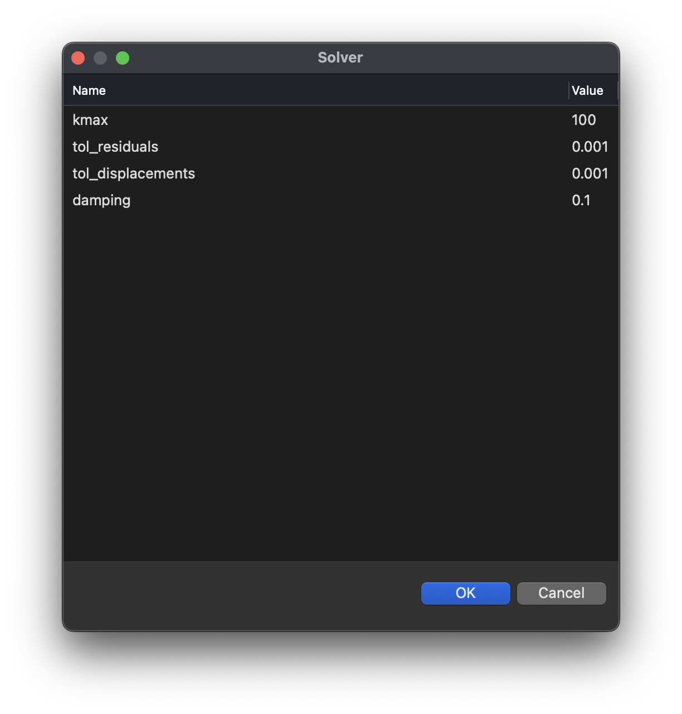
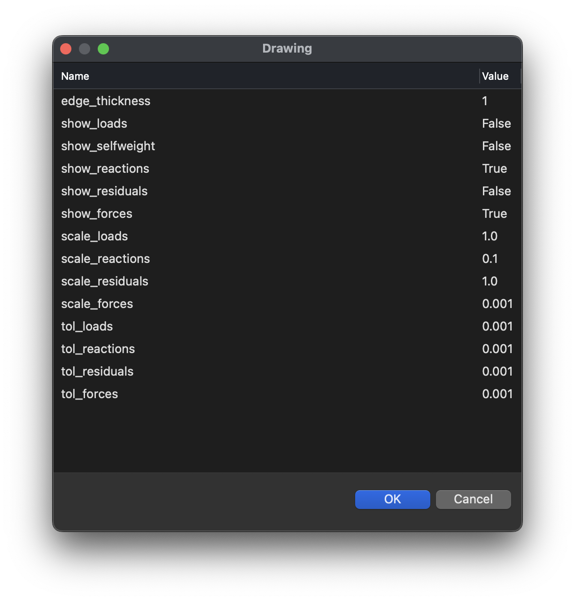
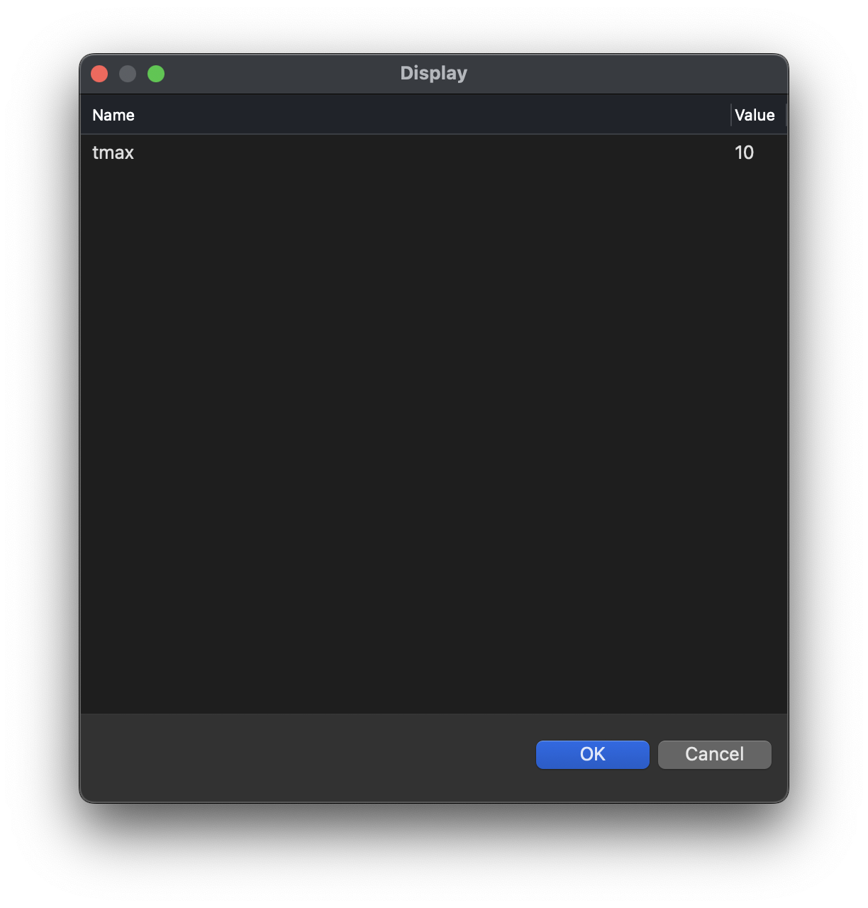

# Settings

To inspect or modify the settings of FormFinder, use the `FF_settings` command or the corresponding toolbar button.

The following sections of settings are available:

* Solver
* Drawing
* Display

## Solver

<figure><figcaption></figcaption></figure>

## Drawing

<figure><figcaption></figcaption></figure>

## Display

<figure><figcaption></figcaption></figure>
