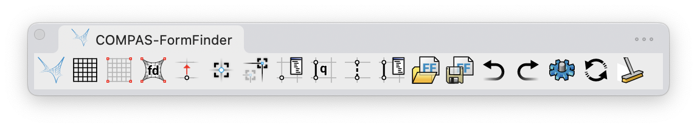
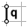

# User Interface

<figure><figcaption>
Screenshot of the toolbar of FormFinder in Rhino 8 on Mac.
</figcaption></figure>

FormFinder defines a series of Rhino commands which can be executed using the Rhino "command prompt" (by simply typing the command name) or through the corresponding toolbar buttons. Below is an overview of the commands and the corresponding buttons.

## FF

<figure><figcaption></figcaption></figure>

Display a dialog with some basic information about the tool and links to the documentation.

## FF\_pattern

<figure><figcaption></figcaption></figure>

Create a force pattern from different types of input.

### RhinoBox

This option requires the following inputs:

* **Rhino DocObject**: An object with a box-like geometry.
* **Resolution U**: The number of faces in the U direction.
* **Resolution V**: The number of faces in the V direction.

### RhinoCylinder

This option requires the following inputs:

* **Rhino DocObject**: An object with a cylinder-like geometry.
* **Resolution U**: The number of faces in the U direction.
* **Resolution V**: The number of faces in the V direction.

### RhinoMesh

This option requires the following inputs:

* **Rhino DocObject**: An object with a mesh geometry.


The number of faces of the mesh is taken "as is".


### RhinoSurface

This option requires the following inputs:

* **Rhino DocObject**: An object with a single NURBS surface.
* **Resolution U**: The number of faces in the U direction.
* **Resolution V**: The number of faces in the V direction.

### MeshGrid

This option requires the following inputs:

* **X SizeX**: Defaults to 10.
* **Y Size**: Defaults to the value of X Size.
* **X Faces**: Defaults to 10.
* **Y Faces**: Defaults to the value of X Faces.

## FF\_anchors

<figure><figcaption></figcaption></figure>

Add or remove pattern anchors.

## FF\_solve\_fd

<figure><figcaption></figcaption></figure>

Solve equilibrium with a constrained, iterative variant of the force density method.

## FF\_anchors\_move

<figure><figcaption></figcaption></figure>

Move the anchored vertices of the pattern.

## FF\_anchors\_constraints

<figure><figcaption></figcaption></figure>

Add geometric constraints to the anchored vertices of the pattern.

## FF\_anchors\_update

<figure><figcaption></figcaption></figure>

Update the position of the constrained vertices by projecting them onto their constraints.

## FF\_vertices\_attrs

<figure><figcaption></figcaption></figure>

Modify the attributes of selected vertices.

## FF\_edges\_q

<figure><figcaption></figcaption></figure>

Modify the force densities (`q`) of selected edges. Two options are available.

### Absolute Value

This option overwrites all the values of the selected edges with the provided value.

### Scaling Factor

This option scales the values of the selected edges individually using the provided scale factor.

## FF\_edges\_delete

<figure><figcaption></figcaption></figure>

Modify the pattern by removing selected edges.
