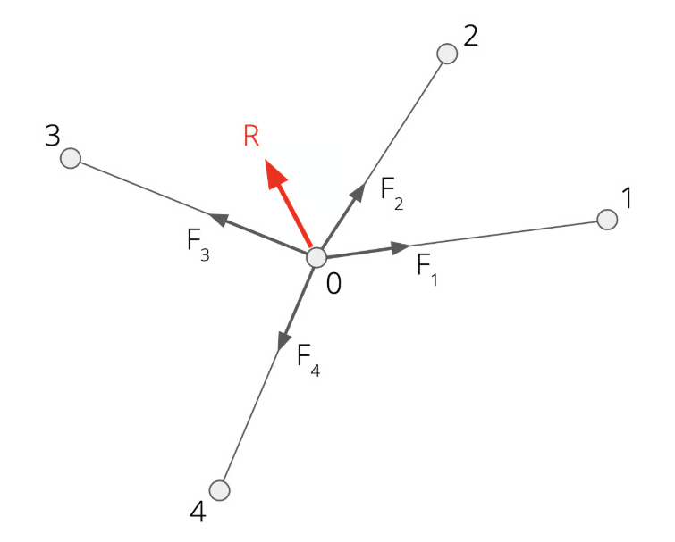

# Force Densities Method

compas-FoFin is based on the Force Density (FD) method. FD is a linear, thus fast method for the form finding of cable nets by solving a set of linear equilibrium equations for certain topology, boundary conditions and prescribed force densities. Some useful references for further reading are listed below:

* Schek, H. (1974). [The force density method for form finding and computation of general networks](https://www.sciencedirect.com/science/article/pii/0045782574900450). Computer Methods in Applied Mechanics and Engineering, 3, 115-134.
* Veenendaal, Diederik & Block, P.. (2012). [An overview and comparison of structural form finding methods for general networks](https://block.arch.ethz.ch/brg/publication/an-overview-and-comparison-of-structural-form-finding-methods-for-general-networks). International Journal of Solids and Structures. 49. 3741–3753. 10.1016/j.ijsolstr.2012.08.008.
* Adriaenssens, S. M., Block, P., Veenendaal, D., & Williams, C. (2014). [Shell structures for architecture: Form finding and optimization](https://block.arch.ethz.ch/brg/publication/shells-for-architecture-form-finding-and-structural-optimization). Taylor and Francis.

## Force Densities

First, let's introduce the important notion of _**force density**_. Schek introduced the force density method in the context of the design of the Munich Olympic Roofs, as the precise construction of these ambitious cable-net geometries required numerical form-finding methods - instead of using only physical models and photogrammetry.

In the FD method, Instead of **prescribing** forces for each of the edges, we will use _**force densities q**_. These are the ratios between the **forces** **F** and **lengths L** per edge.&#x20;

$$
q := \frac{F}{L}
$$

So the same force gives a higher force density in a short edge than in a long edge. And vice versa, with a same length,  a higher force gives a higher force density.

Physically, a force density might not be as intuitive to grasp as a force. However, the force density could be interpreted as the density of woman/man-power pulling on a rope: a constant spacing of persons pulling gives the same force density, regardless of the length of rope. It's like the density of woman/men-force.

<figure><figcaption></figcaption></figure>

Why this notation of q is useful, we will see in the explanation of the Force Density method.


## Force Density Method

Let us consider a simple network of a free node connected with edges to 4 anchored nodes. Tensile forces act in the edges. If all the edge forces acting on the free node were in **equilibrium**, the **sum** of these forces would be equal to **zero** in all x-, y- and z-directions:&#x20;

<figure><figcaption><p>node with edge forces in equilibrium</p></figcaption></figure>

We can write out the equilibrium  in **components** for each independent **coordinate direction** x, y, and z:

$$
F_{1, x} + F_{2, x} + F_{3, x} + F_{4, x}  = 0 \\F_{1, y} + F_{2, y} + F_{3, y} + F_{4, y}  = 0 \\F_{1, z} + F_{2, z} + F_{3, z} + F_{4, z}  = 0
$$

However, for a randomly generated geometry, it is very unlikely that all forces cancel out, and the edge forces would sum up to a **residual force R** (in red), meaning the system is not in equilibrium yet and would move:

<figure><figcaption><p>node with edge forces with residual force (in red)</p></figcaption></figure>

$$
F_{1, x} + F_{2, x} + F_{3, x} + F_{4, x}  = R_x \\F_{1, y} + F_{2, y} + F_{3, y} + F_{4, y}  = R_y \\F_{1, z} + F_{2, z} + F_{3, z} + F_{4, z}  = R_z
$$

&#x20;This can also be expressed in a more compact way through **summation Σ**:&#x20;

$$
\sum_{j=1}^4 F_{j, x} = R_x \\\sum_{j=1}^4 F_{j, y} = R_y \\\sum_{j=1}^4 F_{j, z} = R_z
$$

The force **components** in the **x-, y- and z-direction** can be expressed as follows. For each of the coordinates, the direction cosine is given by the **difference in coordinates** (or projection) divided by the **length of the edges**:&#x20;

\


$$
\sum_{j=1}^4 F_{j}\frac{x_j - x_0}{L_j} = R_x \\\sum_{j=1}^4 F_{j}\frac{y_j - y_0}{L_j} = R_y \\\sum_{j=1}^4 F_{j}\frac{z_j - z_0}{L_j} = R_z
$$


The edge lengths in the equations are dependent on the coordinates of the edge start and end nodes:


$$
L_{0j} = \sqrt{(x_j−x_0)^2 + (y_j−y_0)^2 + (z_j−z_0)^2}
$$

\
This results in a system of nonlinear equations that would need to be solved iteratively. So the concept of force densities was introduced as a _mathematical trick_ to allow solving the equilibrium equations as a linear system of equations.

By predefining the force densities for each of the edges, the lengths are taken out of the equations. Hence, the length in the denominator does no longer need to be updated for the new geometry at each step, and the equilibrium can be described as a **linear** system of equations:

$$
\sum_{j=1}^4 F_{j}\frac{x_j - x_0}{L_j}
= \sum_{j=1}^4 q_{j} . (x_j - x_0) = 0
\\\sum_{j=1}^4 F_{j}\frac{y_j - y_0}{L_j}
= \sum_{j=1}^4 q_{j} . (y_j - y_0) = 0
\\\sum_{j=1}^4 F_{j}\frac{z_j - z_0}{L_j}
= \sum_{j=1}^4 q_{j} . (z_j - z_0) = 0
$$

The methods can be expressed with vectors and matrices in order to compute efficiently the new positions of the nodes:

```python
    v = len(vertices)
    free = list(set(range(v)) - set(fixed))
    xyz = asarray(vertices, dtype=float).reshape((-1, 3))
    q = asarray(q, dtype=float).reshape((-1, 1))
    p = asarray(loads, dtype=float).reshape((-1, 3))
    C = connectivity_matrix(edges, "csr")
    Ci = C[:, free]
    Cf = C[:, fixed]
    Ct = C.transpose()
    Cit = Ci.transpose()
    Q = diags([q.flatten()], [0])
    A = Cit.dot(Q).dot(Ci)
    b = p[free] - Cit.dot(Q).dot(Cf).dot(xyz[fixed])

    xyz[free] = spsolve(A, b)

    l = normrow(C.dot(xyz))  # noqa: E741
    f = q * l
    r = p - Ct.dot(Q).dot(C).dot(xyz)

    return xyz, q, f, l, r
```

